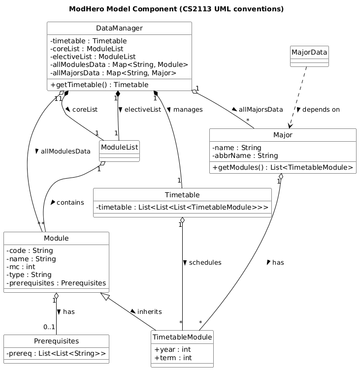

# Developer Guide

## Acknowledgements

This project was built based on the architecture and documentation style of [AddressBook-Level3 (AB3)](https://se-education.org/addressbook-level3/).  
Concepts, diagram formats, and document structure have been adapted from it for educational purposes.

---

## Design & Implementation

This section describes the overall design of **ModHero**, followed by explanations of each major component.  
It serves as a roadmap for future developers to understand how the system is structured, how the components interact, and how each part fulfills its role.

---

## High-Level Architecture

The **ModHero** architecture follows a modular structure inspired by AddressBook-Level3.  
It comprises four main components:
- **UI** — Handles user interaction and display.
- **Logic** — Parses and executes user commands.
- **Model** — Maintains in-memory data (modules, majors, timetable).
- **Storage** — Manages persistent data on disk.

At launch, `Main` initializes these components and connects them.  
At shutdown, it ensures all data is saved correctly to persistent storage.

---

## Model Component

**API:** `Model.java`

The **Model component** is responsible for managing all in-memory data of ModHero.  
It encapsulates the application’s state — including modules, majors, prerequisites, and the user’s 4-year timetable — and provides APIs for other components to access or modify this data safely.

It resides in the package `modhero.data` and its sub-packages:
- `modhero.data.major`
- `modhero.data.modules`
- `modhero.data.timetable`

### Structure of the Model Component

  
*Figure 1 – UML class diagram showing relationships within the Model component.*

### Key Responsibilities

- **DataManager** – Central data coordinator that loads, stores, and provides access to model entities.
- **Timetable** – Maintains the 4-year plan, organizing modules by year and semester.
- **Module** – Represents an individual module with code, name, MCs, and prerequisite structure.
- **ModuleList** – Groups modules logically (e.g., core or elective).
- **Prerequisites** – Captures module prerequisites as nested lists.
- **MajorData** – Defines core module sets for each supported major.
- **TimetableModule** – Extends `Module` by adding `year` and `term` fields to specify when a module is taken.

### Design Rationale

- **Inheritance:** `TimetableModule` *is-a* `Module`, enriched with temporal (year, term) information.
- **Composition:** `DataManager` *has-a* `Timetable`, `ModuleList`, and `Prerequisites` — they exist only while `DataManager` exists.
- **Aggregation:** Modules and majors can exist independently and are aggregated under `DataManager`.

This separation allows the Model to remain cohesive yet modular, enabling clean integration with other components such as Storage and Logic.

---

## Storage Component

The Storage component is responsible for loading and saving essential application data.
It reads text files from predefined directories and converts their contents into a structured, accessible format for other components to process.

Two primary classes, ModuleLoader and MajorLoader, rely on Storage to retrieve module and major data.
These loaders then deserialize the loaded text into objects such as Module, Major, and Prerequisites, which are stored in in-memory hash maps for efficient access.
The process is supported by two utility classes, SerialisationUtil and DeserialisationUtil, which enhance data conversion and validation.

Each text file is stored in a unique, well-defined format, ensuring accurate data retrieval without missing words or parsing errors.
Deserialization also serves as a validation step, confirming that the entire file has been successfully read and processed.

To maintain data integrity and readability, all data should be serialized before saving, ensuring a consistent and reliable file structure for future loading operations.

---

## Product Scope

### Target User Profile
{Describe the target user profile.}

### Value Proposition
{Describe the value proposition: what problem does it solve?}

---

## User Stories

| Version | As a ... | I want to ... | So that I can ... |
|----------|-----------|---------------|-------------------|
| v1.0 | NUS student | view a list of available commands | understand how to use ModHero efficiently |
| v1.0 | NUS student | specify my major | load the correct core and elective modules for my degree |
| v1.0 | NUS student | generate a recommended 4-year study plan | visualize my academic progression and ensure graduation requirements are met |
| v1.0 | NUS student | add a specific module to a semester | customize my study plan according to my interests or scheduling needs |
| v1.0 | NUS student | delete a module from my timetable | adjust my plan when I drop or change modules |
| v1.0 | NUS student | list all core and elective modules for my major | plan my semesters with awareness of compulsory and optional modules |
| v2.0 | NUS student | check prerequisites of a module | avoid planning invalid module combinations |
| v2.0 | NUS student | automatically verify that all prerequisites are met | ensure my plan is valid before registration |
| v2.0 | NUS student | save my timetable to a file | persist my customized schedule for later use |
| v2.0 | NUS student | load my saved timetable | restore my plan without re-entering all modules |
---

## Non-Functional Requirements

{Give non-functional requirements.}

---

## Glossary

* *glossary item* — Definition.

---

## Instructions for Manual Testing

{Give instructions on how to do manual testing, e.g., how to load sample data or verify stored files.}
