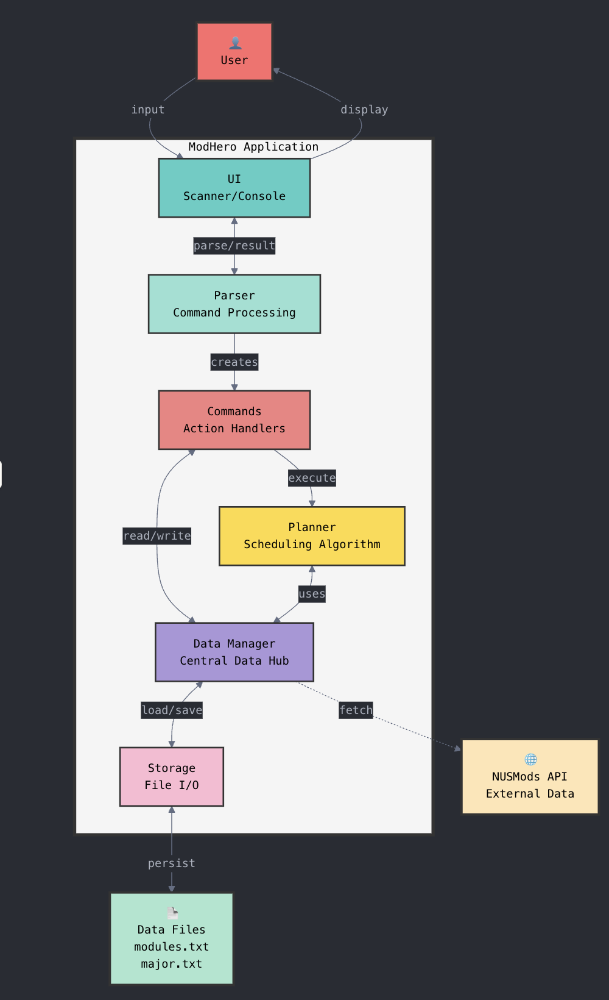

# Developer Guide

## Acknowledgements

{list here sources of all reused/adapted ideas, code, documentation, and third-party libraries -- include links to the original source as well}

## Design & implementation

{Describe the design and implementation of the product. Use UML diagrams and short code snippets where applicable.}
## High-Level Architecture

## Product scope
### Target user profile

{Describe the target user profile}

### Value proposition

{Describe the value proposition: what problem does it solve?}

## User Stories

|Version| As a ... | I want to ... | So that I can ...|
|--------|----------|---------------|------------------|
|v1.0|new user|see usage instructions|refer to them when I forget how to use the application|
|v2.0|user|find a to-do item by name|locate a to-do without having to go through the entire list|

## Non-Functional Requirements

{Give non-functional requirements}

## Glossary

* *glossary item* - Definition

## Instructions for manual testing

{Give instructions on how to do a manual product testing e.g., how to load sample data to be used for testing}

## Storage Overview

`Storage` is part of the `modhero.storage` package and is responsible for:
- Maintaining file structure integrity.
- Reading raw data lines from disk.
- Writing serialized objects back to files.
- Converting stored text data into in-memory objects (`Module`, `Major`, `Prerequisites`, `ModuleList`) through collaboration with the `Serialiser` class.

Interactions mainly involve the `Serialiser` and the `modhero.data` model classes.

## Serialiser
###
